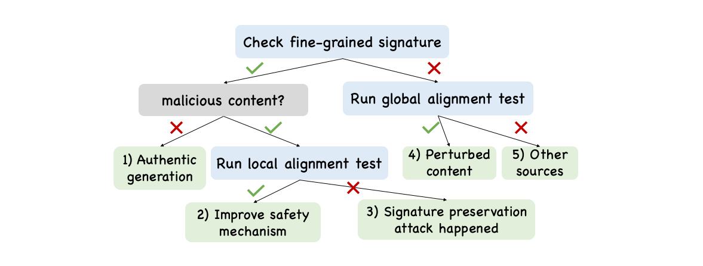

# Bileve: Securing Text Provenance in Large Language Models Against Spoofing with Bi-level Signature (NeurIPS'24)


## Overview
Text watermarks for LLMs are promising for combating deepfakes and harmful content but are vulnerable to spoofing attacks that can manipulate meaning or forge content, risking wrongful attribution. To address this, we propose Bileve, a bi-level signature scheme that embeds fine-grained integrity bits to counter spoofing and a coarse-grained signal for tracing text sources when signatures are invalid. Using a novel rank-based sampling strategy, Bileve detects and differentiates 5 scenarios, enhancing reliability in text provenance and LLM regulation. 





## Installation
### Step 1: Clone the Repository
```bash
git clone https://github.com/username/Bileve-official.git
cd Bileve-official
```

### Step 2: Set Up the Environment
#### Using Virtual Environment:
```bash
python3 -m venv venv
source venv/bin/activate
```

### Step 3: Install Dependencies
```bash
pip install -r requirements.txt
```


## Usage
### Running the Framework
Execute the main script with the required arguments:
```bash
python main.py --model facebook/opt-1.3b \
               --prompt "Watermarking is" \
               --mode bileve \
               --gamma 0.001 \
               --m 512 \
               --n 80 \
               --d 44 \
               --key 42 \
               --seed 0 \
               --out_dir ./log_test \
               --logfile test.log
```

### Arguments
- `--model`: Pre-trained language model (default: `facebook/opt-1.3b`).
- `--prompt`: Input text to watermark (default: `Watermarking is`).
- `--mode`: Watermarking mode (default: `bileve`).
- `--gamma`: Weighted rank parameter (default: `0.001`). 
- `--m`: The requested length of the generated text (default: `512`). Note: It should be larger than the signature length. In this demo we use ECDSA p-256 curve, which results in 512-bit signature. 
- `--n`: Length of the watermark key sequence (default: `80`).
- `--d`: Number of tokens used as message (default: `44`).
- `--key`: Key for generating the random watermark sequence (default: `42`).
- `--seed`: Seed for reproducible randomness (default: `0`).
- `--out_dir`: Directory for saving results (default: `./log_test`).
- `--logfile`: Name of the log file (default: `test.log`).

## Key Modules
### `bileve.py`
- Handles watermark generation and signing using elliptic curve cryptography. One can replace this with any other signing method. 

### `detect.py`
- Contains methods for verifying and detecting watermarked content, including statistical tests. 


## Example Workflow
1. **Generate Watermarked Text**:
   The `generate` function embeds a bi-level signature into the input text.

2. **Verify Watermarked Content**:
   The `verify` function ensures the integrity of the watermarked content using the public key.

3. **Detect Tampering**:
   The `permutation_test` method applies statistical testing to detect alterations. This implementation is borrowed from [Robust Distortion-free Watermarks for Language Models](https://github.com/jthickstun/watermark/tree/main). 


## Project Structure
```
Bileve-official/
├── bileve.py            # Core watermarking functionalities
├── detect.py            # Detection and verification methods
├── levenshtein.pyx      # Cython implementation of Levenshtein distance
├── main.py              # Entry point for the framework
├── mersenne.py          # Mersenne Twister RNG utilities
├── utils.py             # Utility functions
├── requirements.txt     # Python dependencies
├── README.md            # Project documentation
```

## Citation
If you use Bileve in your research or development, please cite this repository:

```bibtex
@inproceedings{
zhou2024bileve,
title={Bileve: Securing Text Provenance in Large Language Models Against Spoofing with Bi-level Signature},
author={Tong Zhou and Xuandong Zhao and Xiaolin Xu and Shaolei Ren},
booktitle={The Thirty-eighth Annual Conference on Neural Information Processing Systems},
year={2024}
}
```

## License
This project is licensed. See the `LICENSE` file for details.